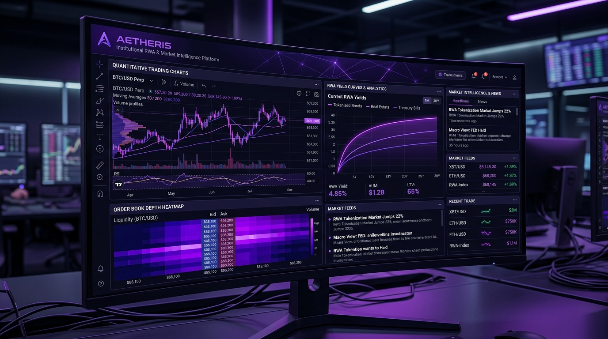

<div align="center">



# AETHERIS TERMINAL
### Institutional Real-World Asset (RWA) Solvency & Quantitative Market Intelligence Platform

[](https://github.com/sandman-sh/AETHERIS.git)
[](https://coinmarketcap.com/api/)
[](https://www.typescriptlang.org/)
[](https://react.dev/)
[](https://vite.dev/)
[](LICENSE)

</div>

---

## 🏛️ Executive Overview

**AETHERIS Terminal** is an institutional financial intelligence and risk evaluation workstation powered by the **CoinMarketCap Enterprise API**. 

Engineered for quantitative asset managers, sovereign wealth desks, and risk controllers, AETHERIS unifies real-time Real World Asset (RWA) legal issuer audits, derivative cascade fragility modeling, multi-maturity macro yield curve tracking, 24/7 tokenized equity spread analytics, multi-chain decentralized exchange (DEX) forensic liquidity profiling, and embedded AI autonomous workstation execution into a unified high-throughput trading interface.

---

## ⚡ Core Analytical Engines

### 1. VeritasRWA — Sovereign Solvency & Exit Liquidity Engine
* **CoinMarketCap Endpoints**: `/v5/real-world-assets/quotes/latest`, `/v5/real-world-assets/issuers`, `/v1/dex/token/pools`, `/v1/dex/holders/detail`
* **Core Capabilities**:
  * Cross-verifies tokenized sovereign obligations (Ondo USDY, BlackRock BUIDL, Mountain USDM, Matrixdock STBT) against legally registered custodians and attestations.
  * Quantitative Order Impact Matrix: Recalculates non-linear constant-product and concentrated liquidity slippage curves dynamically across varying block size orders ($50K to $10M+).
  * Audits reserve quality tiers, custody domiciles, counterparty risks, and regulatory jurisdictions.

### 2. CascadeRadar — Derivative Liquidation Spiral Scanner & CFI
* **CoinMarketCap Endpoints**: `/v5/derivatives/liquidations/cryptocurrency/list/latest`, `/v5/cryptocurrency/derivatives/market-pairs/list/latest`, `/v1/dex/token/pools`
* **Core Capabilities**:
  * Continuously evaluates the **Cascade Fragility Index (CFI)**: a proprietary quantitative metric contrasting clustered derivative liquidation exposure against localized spot decentralized pool depth.
  * Anticipates liquidity vacuums and sharp deleveraging events before they propagate across venue boundaries.
  * Tracks exchange open interest (OI) imbalances and liquidation cascades in real time.

### 3. BasisVerse — Macro Yield-Curve & Basis Navigator
* **CoinMarketCap Endpoints**: `/v5/real-world-assets/assets/list`, `/v5/real-world-assets/quotes/latest`
* **Core Capabilities**:
  * Dynamic multi-maturity yield curve visualization charting short-duration Tokenized US Treasuries (~5.15% APY) alongside decentralized lending protocols (Aave, Morpho) and delta-neutral funding rate arbitrage.
  * Institutional Yield Calculator: Computes gross vs. net yield capture accounting for borrowing costs, gas overhead, and redemption lockup windows.

### 4. ParityGuard — 24/7 Tokenized Equity Spread Engine
* **CoinMarketCap Endpoints**: `/v5/real-world-assets/market-pairs/list`, `/v5/real-world-assets/quotes/latest`
* **Core Capabilities**:
  * Real-time monitoring of round-the-clock on-chain trading for tokenized equities (bNVDA, bAAPL, bTSLA, bSPY, bCOIN) during traditional exchange market closures.
  * Quantifies weekend basis divergence and synthetic premium/discount spreads relative to Friday NYSE/Nasdaq official closing benchmarks.

### 5. GhostWhale — Multi-Chain DEX Forensic Sentinel
* **CoinMarketCap Endpoints**: `/v1/dex/tokens/trending/list`, `/v1/dex/holders/detail`
* **Core Capabilities**:
  * Cross-chain telemetry across Solana, Base, Ethereum, and Arbitrum decentralized trading pools.
  * Distinguishes genuine institutional accumulation from wash-trading clusters, cyclical liquidity recycling, and circular MEV routing.

### 6. KIMO — Institutional Autonomous Copilot
* **Runtime**: High-speed neural reasoning gateway integrated directly into the terminal window manager.
* **Autonomous Execution**:
  * Directly controls workspace layouts, opens/closes analytical engines, tunes stress thresholds, updates asset filters, and switches visual modes programmatically via structured actions.

### 7. CMC Telemetry & Audit Stream
* Real-time transparent request ledger capturing upstream API status codes, response latencies, cryptographic proof timestamps, one-click cURL commands, and inspectable payload payloads.

---

## 🔒 Zero-Leak Security Architecture

AETHERIS implements an air-gapped server proxy architecture ensuring enterprise credentials remain protected:

```
[ Browser / Client UI ]  
       │  (Requests /api/cmc/* & /api/chat)
       ▼
[ Local Development Server Proxy (Vite Node Middleware) ]
       │  (Injects CMC_API_KEY & OPENROUTER_API_KEY server-side)
       ▼
[ Upstream CoinMarketCap Pro API / OpenRouter AI Gateway ]
```

* **Zero Client-Side Exposure**: API keys are parsed server-side inside `vite.config.ts`. No credentials exist in client bundles, browser storage, or client-side network headers.
* **Deterministic Fallback Engine**: If an upstream API key is not configured, the terminal seamlessly transitions to verified baseline snapshots, ensuring complete operational availability for all 5 engines and analytical tools.
* **Key Status Verification**: `/api/cmc-status` verifies environment readiness while masking key strings (`••••••••`).

---

## 🚀 Quick Start Guide

### Prerequisites
* **Node.js**: v18.0.0 or higher (v20+ recommended)
* **npm**: v9.0.0 or higher
* **Git**

### Installation & Execution

```bash
# 1. Clone the repository
git clone https://github.com/sandman-sh/AETHERIS.git

# 2. Enter the project directory
cd AETHERIS

# 3. Install dependencies
npm install

# 4. Configure environment credentials
cp .env.example .env
```

Edit your `.env` configuration file:
```env
# CoinMarketCap API Key
CMC_API_KEY=your_coinmarketcap_api_key_here

# OpenRouter AI Key for KIMO Copilot (Optional)
OPENROUTER_API_KEY=your_openrouter_api_key_here
OPENROUTER_MODEL=deepseek/deepseek-v4-flash
```

```bash
# 5. Launch the development workstation
npm run dev
```

The terminal interface will be active at:
* **Local Workspace**: `http://localhost:5174/` (or default port configured)
* **API Telemetry**: `http://localhost:5174/api/cmc-status`

---

## 🛠️ Production Build & Verification

```bash
# Type check and generate production bundle
npm run build

# Preview production build locally
npm run preview

# Execute linter checks
npm run lint
```

---

## 💻 Tech Stack & Institutional Design

| Layer | Technology |
| :--- | :--- |
| **Framework** | React 19, TypeScript 5 |
| **Build Tooling** | Vite 8, Tailwind CSS 4 |
| **Data Visualization** | Recharts, Custom Canvas Visualizers, Lucide Icons |
| **Market Data** | CoinMarketCap Professional API Suite (v1 & v5) |
| **Intelligence** | OpenRouter Neural Inference (DeepSeek Flash) |
| **State & Windowing**| Multi-Window Workspace Engine, Dynamic Theme Orchestrator |

---

## 🌐 Official Repository

* **GitHub**: [https://github.com/sandman-sh/AETHERIS.git](https://github.com/sandman-sh/AETHERIS.git)
* **Source Code Repository**: `sandman-sh/AETHERIS`

---

## 📄 License

Proprietary & Institutional Financial Analytics Platform. All rights reserved.
